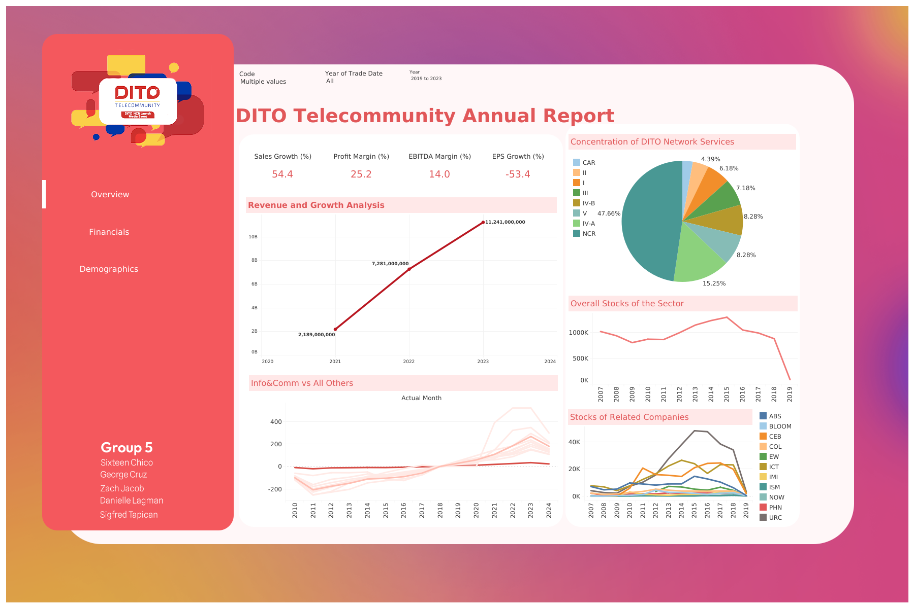
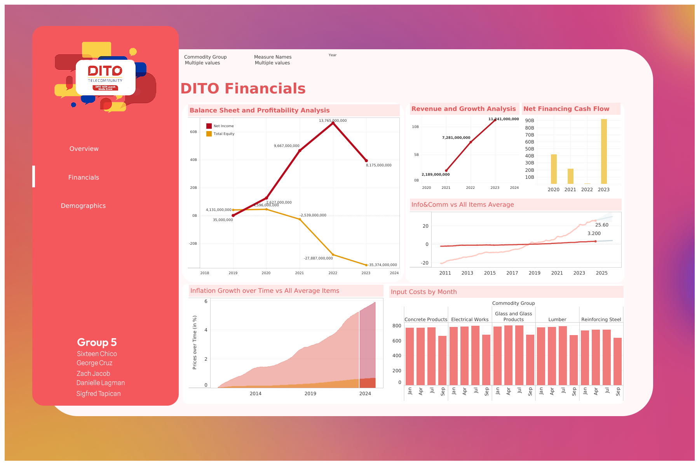
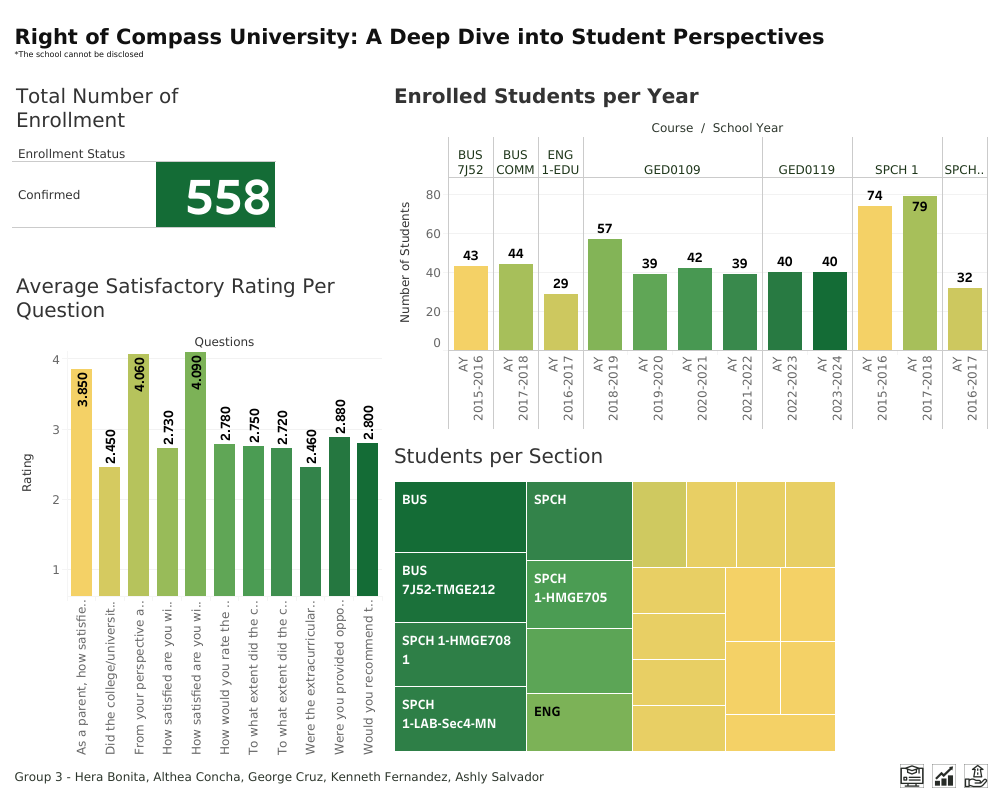
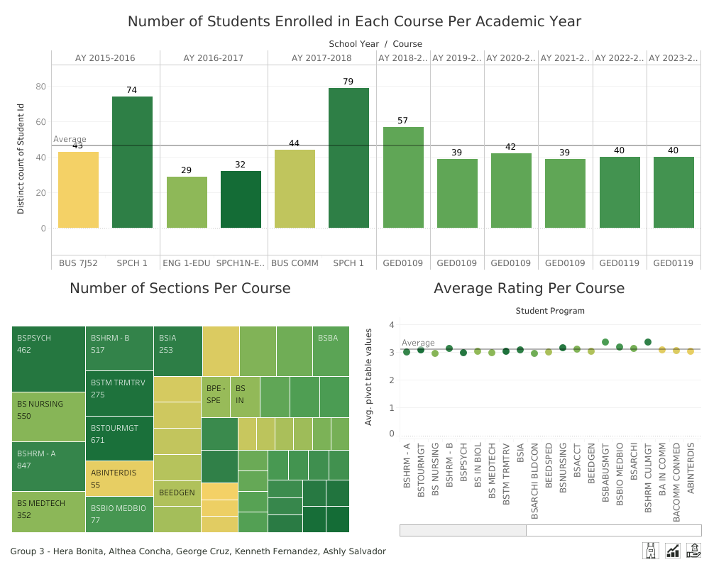
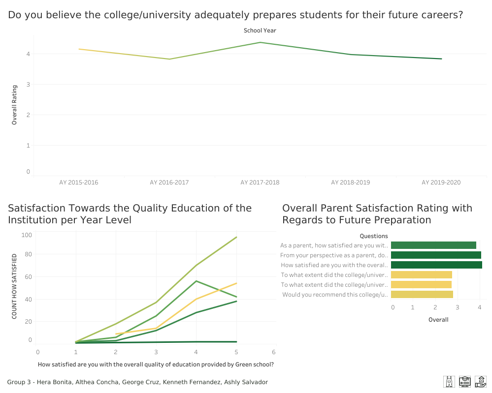
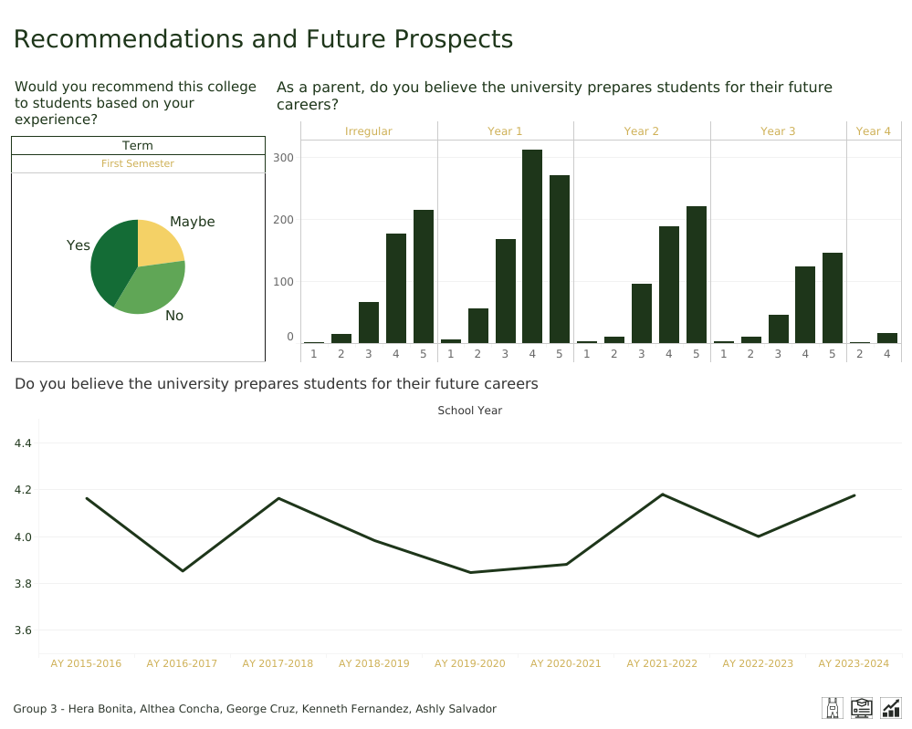
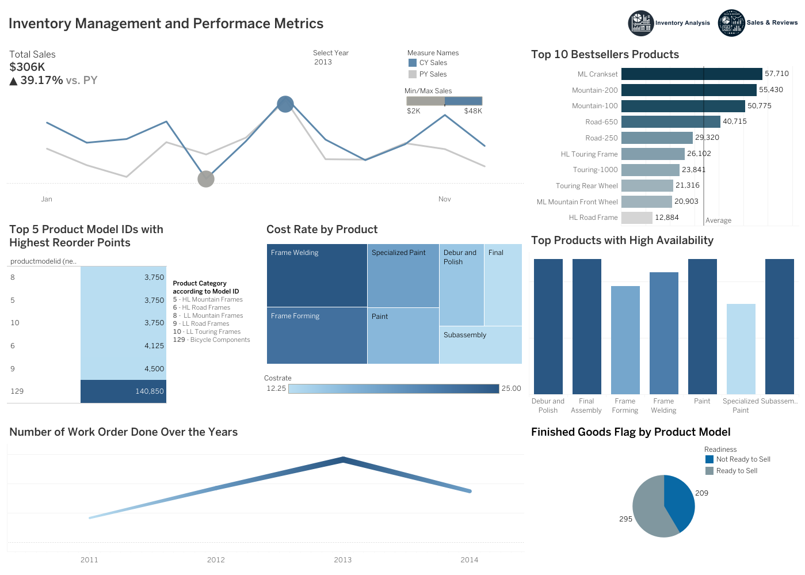
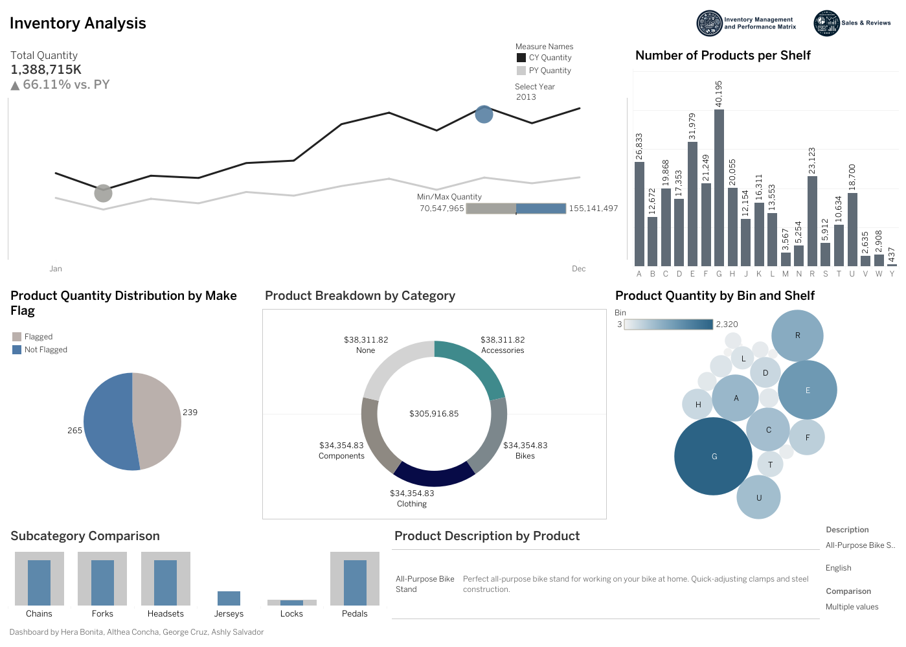
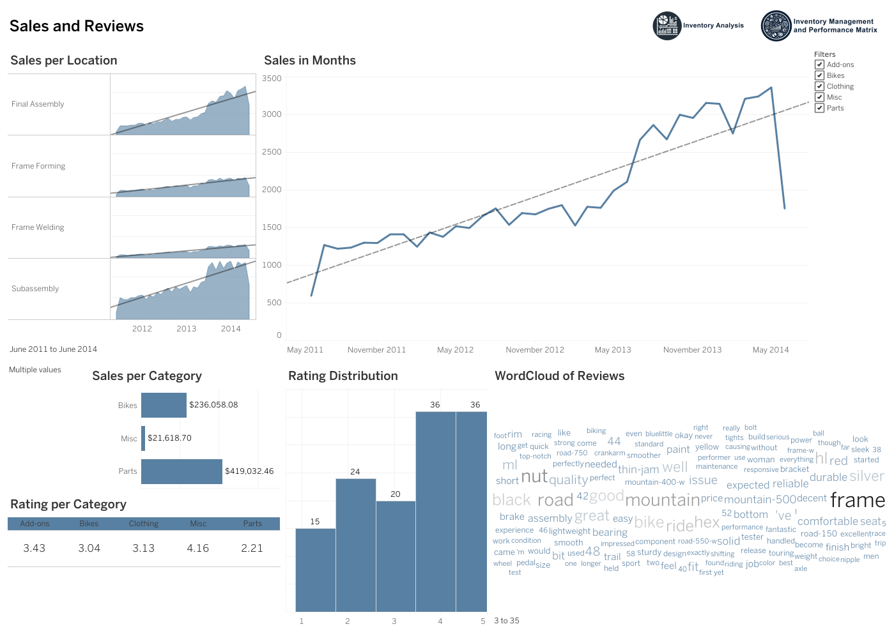

# Data Visualization Case Studies

A collection of dashboard and visual-analytics projects exploring **public-interest, business, customer, financial, inventory, and operational data**.

My visualization work focuses on turning structured data into dashboards that make patterns, performance indicators, and decision-relevant information easier to understand and communicate.

## Featured Work

### Earthquake & Building Safety Visualization — Featured by Rappler

One of my dashboard visualizations was featured in Rappler's article **“How engineers check if a building is safe after an earthquake.”**

The article discusses how engineers evaluate structural safety following earthquakes and how buildings are assessed for continued occupancy and potential hazards.

➡️ [Read the Rappler article](https://www.rappler.com/environment/disasters/how-engineers-check-building-safety-after-earthquake/)

Having the visualization used in a public-facing news article was an opportunity to see data visualization applied beyond the classroom and used as part of communicating a real-world public-safety topic.

---

## Other Dashboard Projects

### DITO Telecommunity Analysis

A dashboard-based analysis of DITO Telecommunity covering company performance from several perspectives.

The project includes views focused on:

* overall company indicators;
* financial performance; and
* demographic and market information.

#### Overview

#### Financial Analysis

#### Demographic Analysis

---

### Student Perspectives Analysis

A multi-page dashboard exploring student experiences and perspectives.

The analysis examines:

* overall respondent characteristics;
* course-specific perspectives;
* areas for growth and improvement; and
* future considerations and recommendations.

#### Introduction

#### Course Analysis

#### Growth

#### Recommendations

---

### Inventory & Sales Analysis

A dashboard focused on operational and commercial performance across inventory and sales.

The project examines:

* inventory levels;
* inventory-performance indicators;
* product and sales behavior;
* customer reviews; and
* operational metrics.

#### Performance Metrics

#### Inventory Analysis

#### Sales & Reviews

---

## Focus Areas

Across these projects, the visualizations were designed around:

* identifying and communicating relevant KPIs;
* presenting trends and comparisons clearly;
* exploring categorical and demographic patterns;
* organizing information across multiple dashboard views;
* communicating results to non-technical audiences; and
* turning data into visual information that can support decisions or public understanding.

## Tools

`Tableau` `Power BI` `Data Visualization` `Dashboard Design` `Data Analysis`

## About This Repository

Some of these projects originated from academic work and have since been reorganized for portfolio presentation.

The repository focuses on the analytical and visualization outputs rather than reproducing their original classroom submission structure.

---

*Selected dashboard and visualization work, including a visualization featured by Rappler.*
